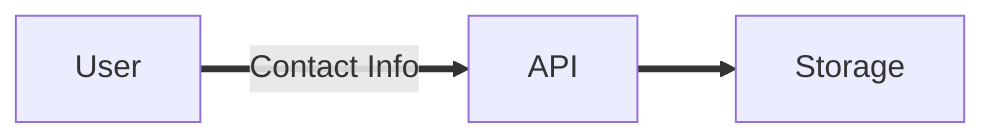
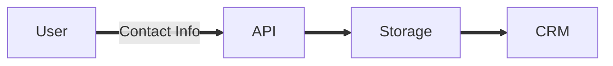
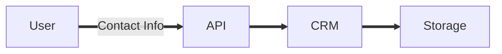
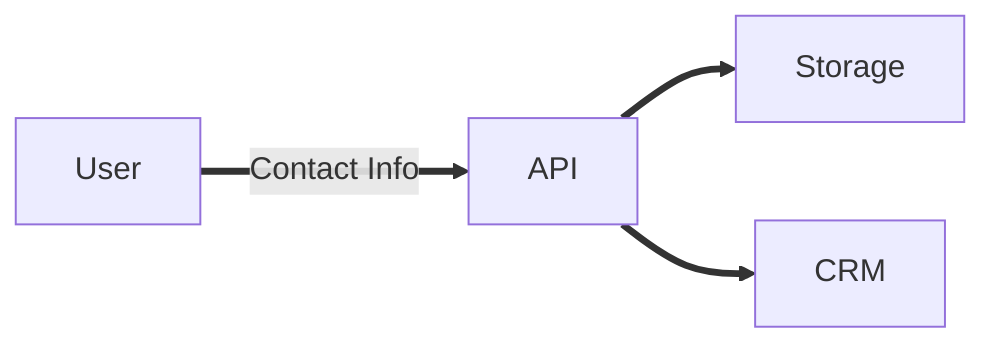

A business has come to you to develop a simple landing page with a contact form so the business can build a following to market events and fundraisers. Following the [Planning a Software Project](/posts/planning-a-software-project/) this shouldn't be too hard of a project to flesh out the details and get started on our code.

# Tasks with Stakeholders

## Outcome
From the high level idea above we already have the desired outcome of `needs to have a way to capture visitors contact information`. The business wants to capture this information to contact the user later to either build a relationship, get involvement or sell a product.

## Requirements
It's time to gather additional details and requirements.

| Requirement | Level |
| :---         |     :---:      |
| Contact form to collect information - name (req), email (req), phone (optional)  | Need to Have |
| Automatically Send Data to a CRM - Needs to Never Fail   | Need to Have |
| Ability to trigger additional automation when a new lead is generated | Nice to Have |


# Tasks without Stakeholders
Now that the outcome and requirements are defined, the backend work can start.

## Research / Brainstorming
If you're just starting your software development journey, there may be a bit of research to do here to even get started on how to build this project. Get a whiteboard and just start writing down things. Write down whatever pops into your head. You can work out the rest of the details later. Right now is about brain dumping to figure out what you know and what you don't know and need to learn.

## Diagramming
Once the brainstorming and research is done it's time to start documenting how to get this project done. Keep in mind some of the documenting and diagramming may have already started during the research/brainstorming phase.

### Data Flow
There's not a lot of data flow and the diagram ends up being. Essentially we have a user submits data to an API which send the data to some sort of storage backend.



If we wanted to include the Nice to Have requirement of automatically sending the data to a CRM, the contact info could be sent after, before or at the same time as the data hits the API. Which is chosen is ultimately up to the developer implementing the solution.

---
<center>Data Flow if Contact Data is Sent After it Hits Storage</center>

---
<center>Data Flow if Contact Data is Sent Before it Hits Storage</center>

---
<center>Data Flow if Contact Data is Sent At the Same Time it Hits Storage</center>

---

### API
Super simple API design because all we are focused on for this is capturing the contact information.
```
POST /leads
```

```json
{
   "first_name": "Test",
   "last_name": "User",
   "email": "test@test.com",
   "phone": "+12408675309"
}
```


### Architecture
Now that the data flow is defined, the infrastructure architecture can begin. Take some time to do some additional research here if you need to.

For this project, we'll leverage AWS since there are some nice built in features to AWS that make this project easy to implement. There are just about infinite ways to implement this within AWS with varying levels of complexity but the goal is to keep this as simple as possible and optimize maintainability and extensibility, so let's take a look at two ways to handle this case in AWS.

#### Option 1

> The site will be hosted on S3 and use the API Gateway as an API. The API Gateway will send the payload directly to SQS, and a Lambda will be triggered to add the information to the business CRM.


_Static Site with Lead Capture and no EventBus_

#### Option 2
The project will be broken up into three parts.
> The static site hosted on S3.


_Static Site_

> A lead API which will use API Gateway, Dynamodb, Lambda and EventBridge


_Static Site_

> A lead import pipeline which will use SQS and Lambda


_Lead importer_

The two architectures here are almost identical, so how do you determine which one to use. Start by looking at the requirements and how each option stacks up against them.

| Requirement | Option 1 | Option 2 |
| :---         |     :---:      | :---: |
| Contact form to collect information  | x | x |
| Automatically Send Data to a CRM - Needs to Never Fail  | x | x |
| Ability to trigger additional automation when a new lead is generated |  | x |

After comparing the options with the requirements, it's apparent that Option 2 gives us the ability to immediately trigger additional automation when a lead is generated by incorporating AWS EventBridge into the architecture. You might be tempted to immediately choose that option because it offers more features and gets closer to what the customer is asking for, but as the developer at least ask yourself

- How hard will it be to maintain?
- Is it worth the time to add that feature now or can we add it later?

If after answering these questions it still makes sense to go with the option that has more features up front then go for it. If it doesn't make sense, then make a plan to go back and add it later if it's necessary. In this case, it would be more work to not implement it now and have to in the future, so it makes sense to add the additional feature in the infrastructure now.

### ERD & UML
This project is so simple, there is no need to create an entity relationship diagram or a unified modeling language diagram so these are outside the scope of this project.

## Monitoring & Alerting
The architecture is simple so the monitoring should be pretty simple too. Identify the points of failure. In this project those might look like

- Any of the AWS services in use being unavailable
- The CRM Importer Lambda failing to import

In this case, the only one that is within the developers control is what happens when the CRM Importer Lambda fails. In this case, the failed payload can be send to a dead letter queue (DLQ) and we can have a message be triggered from a message being present on the queue.

## Breaking Down Work
Now it's time to break down the work. At a high level it might look like

- Setup repo(s), pipeline(s) and any initial infrastructure
- Design site (or use a template)
- Create site code
- Create CRM importer
- Test end to end

## Get to Work
At this point the planning is done and it's time to start coding. There may be things that pop up during the course of development that were unknowns during planning and that's ok. As they come up, look back at the project documentation that has been created during the planning process and update it as necessary. If there are things that come up that need to be taken to the stakeholders, take it to them.
